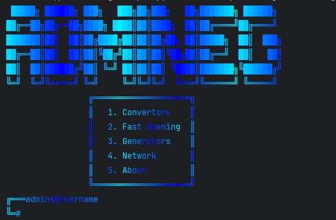

<h1 align="center">Admineg</h1>

<h4 align="center">
  
  <a href="https://t.me/horekisun">Telegram</a>
  |
  <a href="https://github.com/TheDmitryY/Admineg#-installation"">Installation</a>
</h4>

<p align="center">
Admineg - is a console application that helps to comfortably and easily manage the computer system, and also contains useful utilities.
</p>

## 👀 Preview



## ✨ Features
- Comfort administrating
- Usefull utilites and tools
- Free

 ## 🌟 Installation
  ```sh
git clone https://github.com/TheDmitryY/Admineg/
pip install -r requirements.txt
cd Admineg
python3 main.py
```https://github.com/Zproger/GenesisNvim#-installation"
